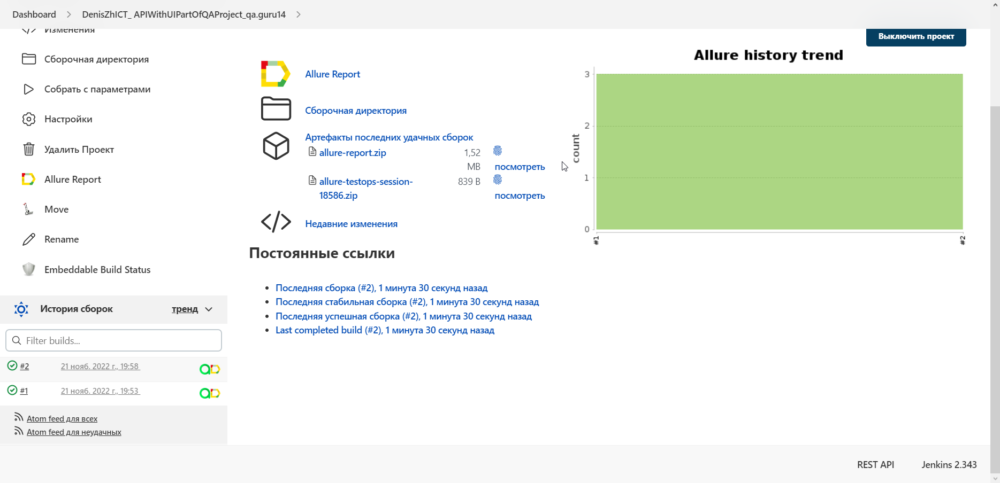
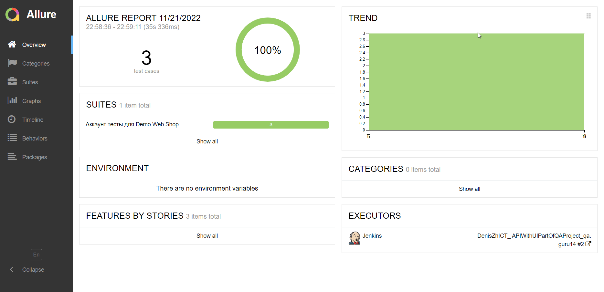
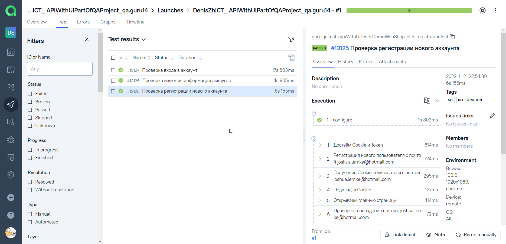
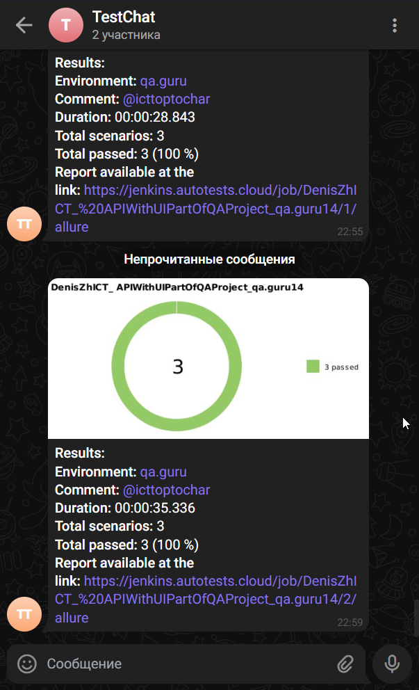
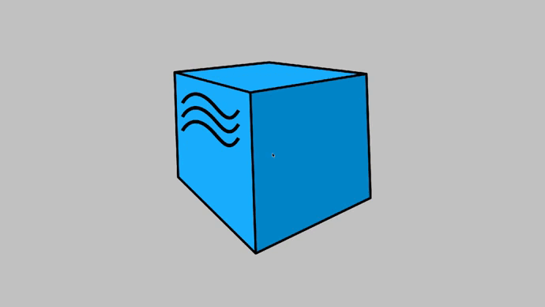

# <a target="_blank" href="https://demowebshop.tricentis.com">Проект: API+UI Автоматизации тестирования Demo Web Shop</a>

## :scroll: Содержание:

- [Технологии и инструменты](#hammer_and_wrench-технологии-и-инструменты)
- [Реализованные проверки](#memo-реализованные-проверки)
- [Сборка в Jenkins](#man_technologist-jenkins-job)
- [Запуск из терминала](#desktop_computer-Запуск-тестов-из-терминала)
- [Allure отчет](#chart_with_upwards_trend-отчет-в-allure-report)
- [Отчёт в Allure TestOps](#bar_chart-отчет-в-allure-testops)
- [Отчет в Telegram](#grapes-уведомление-в-telegram-при-помощи-бота)
- [Видео пример прохождения тестов](#film_strip-пример-видео-о-прохождении-тестов)

## :hammer_and_wrench: Технологии и инструменты

<p align="center">
<a href="https://www.jetbrains.com/idea/"></a>
<a href="https://www.java.com/"></a>
<a href="https://github.com/"></a>
<a href="https://junit.org/junit5/"></a>
<a href="https://gradle.org/"></a>
<a href="https://selenide.org/"></a>
<a href="https://rest-assured.io"></a>
<a href="https://aerokube.com/selenoid/"></a>
<a href="https://github.com/allure-framework/allure2"></a>
<a href="https://qameta.io"></a>
<a href="https://www.jenkins.io/"></a>
<a href="https://telegram.org"></a>
</p>

## :memo: Реализованные проверки

- :white_check_mark: Проверка входа в аккаунт.
- :white_check_mark: Проверка регистрации нового аккаунта.
- :white_check_mark: Проверка смены данных аккаунта.

## :man_technologist: Jenkins job

<a target="_blank" href="https://jenkins.autotests.cloud/job/DenisZhICT_%20APIWithUIPartOfQAProject_qa.guru14/">Сборка в Jenkins</a>
<p align="center">

</p>

### Параметры сборки в Jenkins:

* test_type (Определят тип запускаемых тестов по Tag'ам)
* environment (Определят запуск локальный или удалённый)
* browser_name (Определяет браузер, на котором будет происходить запуск)
* browser_version (Определяет версию браузера)
* browser_size (Определяет размер окна)

### :desktop_computer: Запуск тестов из терминала

```bash
gradle clean All
```

### :globe_with_meridians: Удаленный запуск:

```bash
clean 
${TEST_TYPE} 
-Denvironment=${ENVIRONMENT}
-Dbrowser_name=${BROWSER_NAME}
-Dbrowser_version=${BROWSER_VERSION}
-Dbrowser_size=${BROWSER_SIZE}
```

## :chart_with_upwards_trend: Отчет в <a target="_blank" href="https://jenkins.autotests.cloud/job/DenisZhICT_%20APIWithUIPartOfQAProject_qa.guru14/2/allure/#">Allure report</a>

### Основное окно

<p align="center">

</p>

## :bar_chart: Отчет в <a target="_blank" href="https://allure.autotests.cloud/launch/17008/tree/199960?treeId=0">Allure TestOps</a>

### Test Result Tree

<p align="center">

</p>

## :grapes: Уведомление в Telegram при помощи бота

<p align="center">

</p>

## :film_strip: Пример видео о прохождении тестов

<p align="center">

</p>